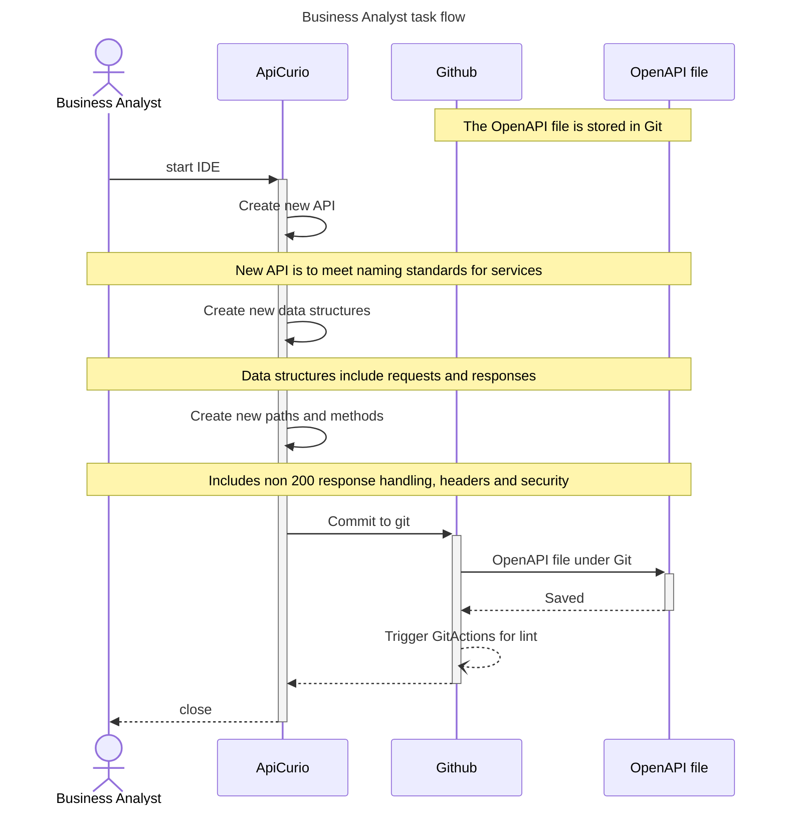

# Analysis flow (start)

The assumptions for this documents are:

* the Git repository has been created and contains little content
* a new API is required to be exposed
* no OpenAPI definition exists
* no API coding has commenced
* ApiCurio is the OpenAPI editor, and this has been linked to GitHub

It is beneficial if the objectives for the API and its high level
service domain scope have already been agreed before starting 
to define the API.

Knowing the information to fetch or tasks that need to be performed
will assist in completing the API specification.  This information 
could be captured in the API specification so as to avoid duplicate 
sources of information that needs to be synchronised.

Information in the OpenAPI specification can be extracted and rendered
into various formats, such as CSV lists of fields, their types,
size and description.

## Sequence Diagram

When creating the OpenAPI specification the information to include:
* Summary and abstract
* Version
* Descriptions for fields
* Field attributes including mandatory, type, enumeration and rules such as size
* Descriptions for paths

A lint process will be run over the OpenAPI specification to ensure adherence
to styling standards.

# End Status of flow

At the end of this flow the OpenAPI (and/or AsyncAPI) specification will 
be in a stable state so that coding can commence.  Minor changes to the 
specification can still occur, and completely new paths can be added.

When the specification changes the version will change according
to semantic versioning rules.  

The OpenAPI definition generated is next used in the 
[developer client start](developer_client_start.md) or
[developer server start](developer_server_start.md) flow.

The client will need to consume a mock service until the
server code is built.

# Reading Notes

Further automation can be achieved by GitActions calling
qaskx-cli, such as registering the OpenAPI specification in the 
devops file.

The ApiCurio and Github components can be substituted for 
other software products uch as Swagger Editor and Bitbucket 
that provide similar capabilities.

