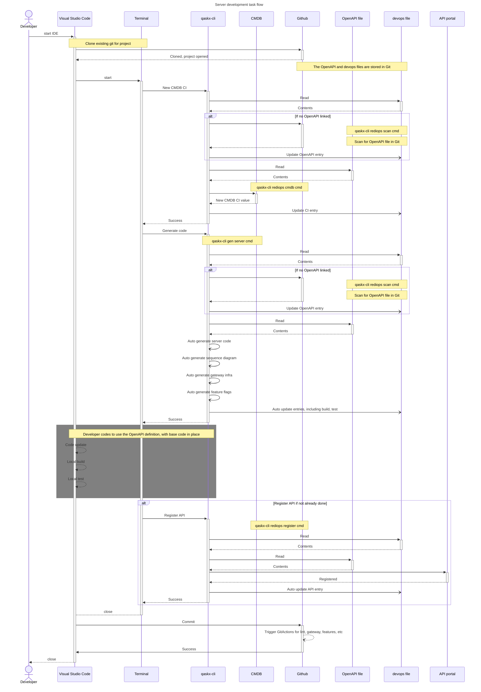
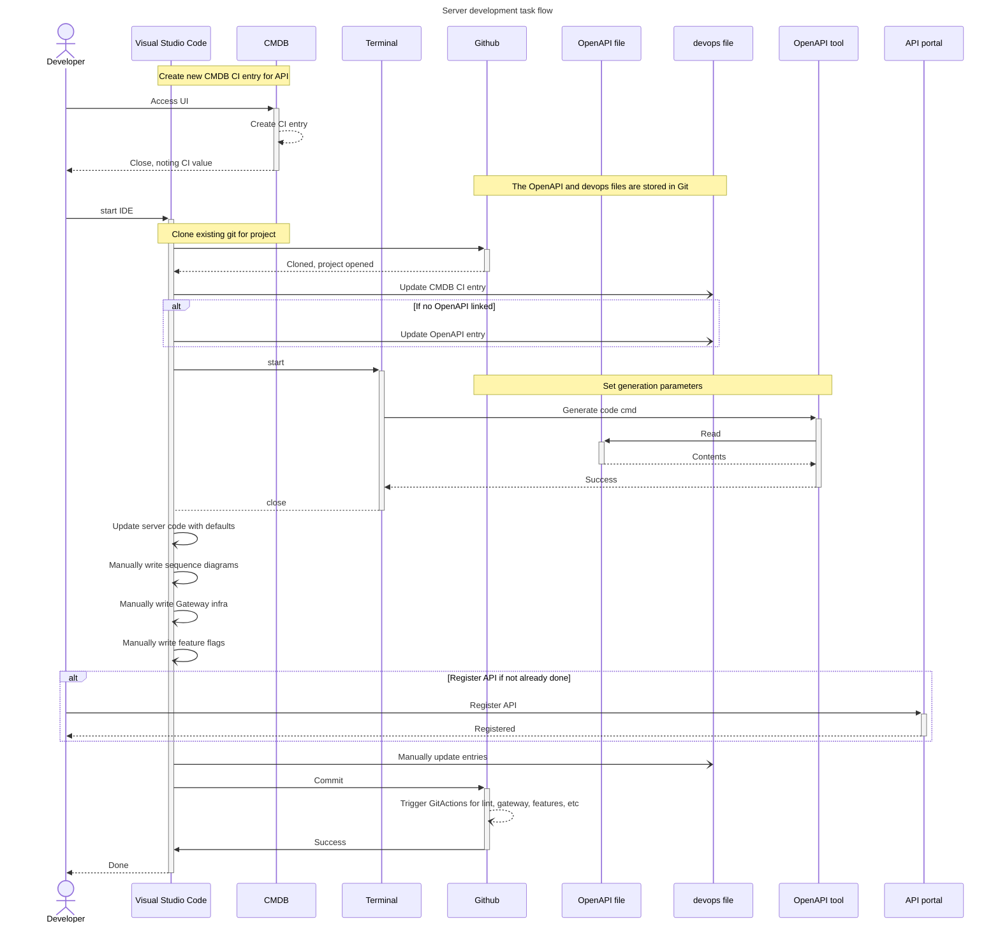

# Back end server developer flow (start)

This is the initialisation of the back end 
code.  Coding the client is covered in document
[developers client start](developers_client_start.md)

The [analysis start](analysis_start.md) is a pre-requisite for
this flow.

The assumptions for this documents are:

* the Git repository has been created
* a new API is required to be exposed
* an OpenAPI definition exists in Git
* no API coding has commenced
* Visual Studio Code has been installed
* Developer has access to the API editor viewer for the OpenAPI specification

## Sequence Diagram

### Automation

The sequence of automation activity using **devops** file and **qaskx-cli** is 
as follows.

The Qaskx command line tool needs to be installed on the developer machine

### Manual

The equivalent sequence of manual activity, non qaskx actions is as follows.
The **devops** file is still used. Without **devops** file you will 
follow whatever your existing process is and recorded the necessary 
details in various documents

The OpenAPI tool needs to be installed on the developer machine.

# End Status of flow

At the end of this flow the basic code stubs exist and have been committed
to Github.  The code can execute and will return not implemented
response results.

# Reading Notes

For automation, some activities can be performed by GitActions calling
qaskx-cli.

The Visual Studio Code, CMDB and Github components can be substituted for 
other software products such IntelliJ and Bitbucket.

