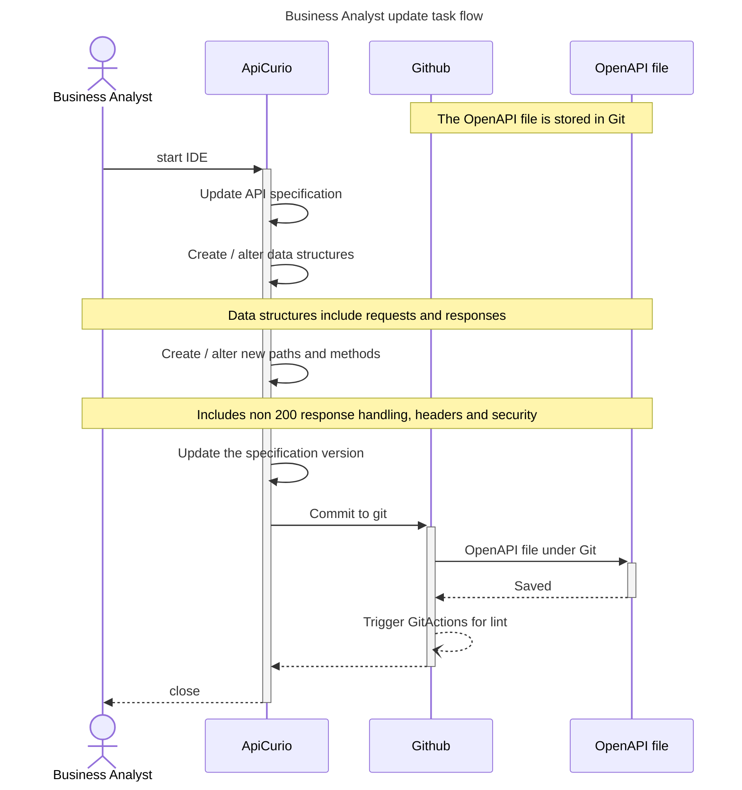
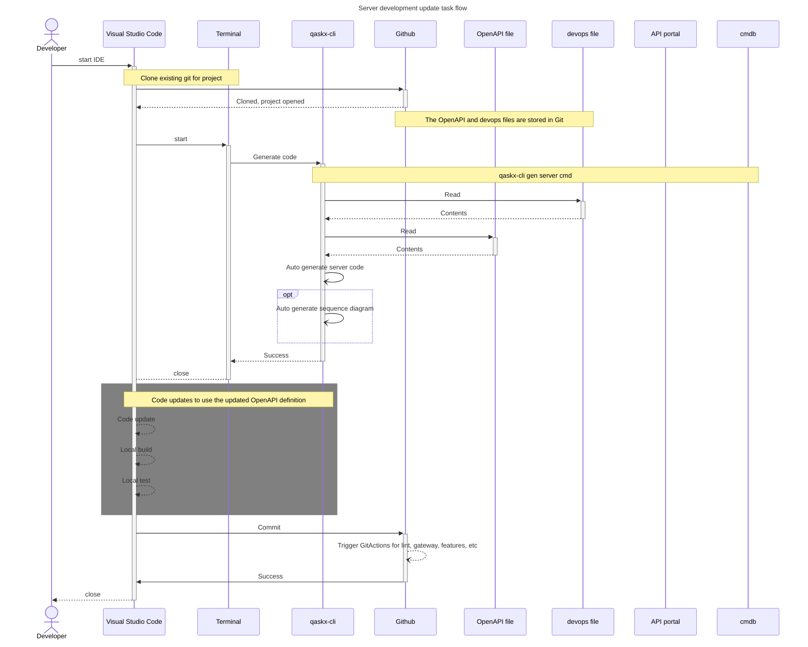
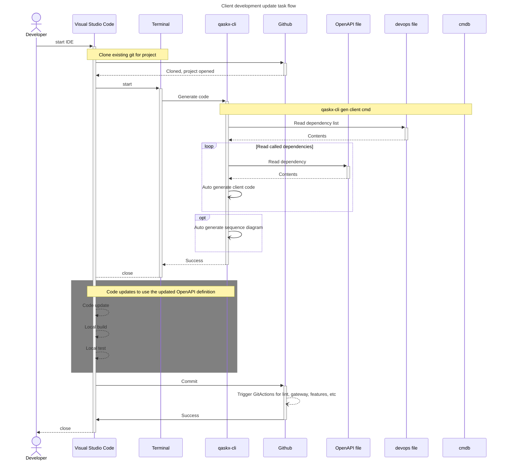

# Developer update flow

_This document is intended to cover the scenario where the **devops** 
file contents change including references to OpenAPI specifications._

## Update the OpenAPI specification

The OpenAPI specification as linked to the publishing server
is updated first.

## Server update

Once the OpenAPI definition has been updated the server code needs to be
re-generated as the publisher of the API.

## Client update

Once the OpenAPI definition has been updated the client code needs to be
re-generated as the consumer of the API.

The code is now updated with the latest OpenAPI definition

# End Status of flow

At the end of this flow the code has been updated with latest 
definitions.

# Reading Notes

Using code generators will break the code in many situations and
therefore using Git and diff tools will help in identifying
what has changed and perform impact analysis.

In many situations with specification changes the compiler
will pick up the changes. Some changes can only be detected
at run time if there is a high level of abstraction.
