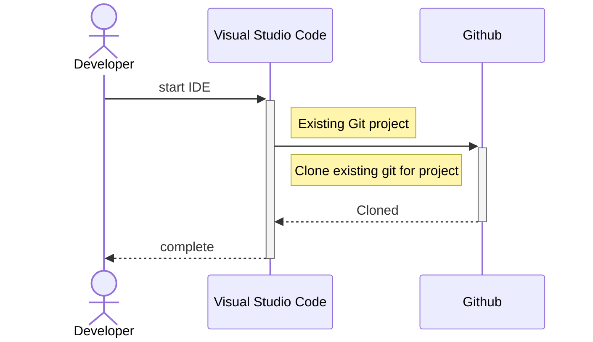

## Quickstart for developers

```mermaid

sequenceDiagram

    actor dev as Developer
    participant vsc as Visual Studio Code
    participant git as Github

    dev ->>+ vsc: start IDE
    Note right of vsc: Existing Git project
    
    vsc ->>+ git : 
    Note right of vsc: Clone existing git for project
    git -->>- vsc : Cloned


    vsc -->>- dev : complete


```

