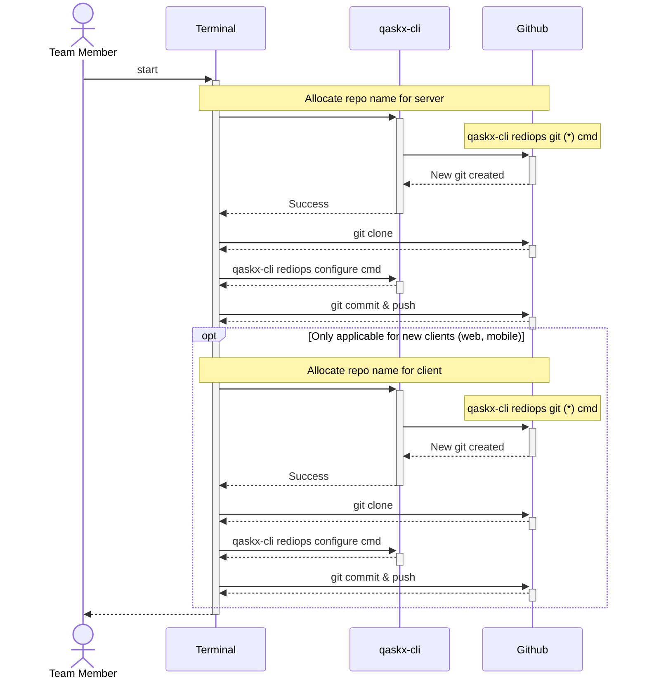

# Project flow

_This document under construction._

## Sequence diagram

The git repositories are now primed and ready for API specification.

The tasks in the sequence diagram is provisioning the required repositories.  
The client repo may already exist for other functionality in which cas it is not
created, but will be used in the [developer client start](developer_client_start.md)

# End Status of flow

At the end of this flow the scope of the API delivery and the service domain
will be understood.

The project information is next used in the 
[analysis start](analysis_start.md) flow.

# Reading Notes

A well defined service domain that is understood and agreed by all parties
will reduce rework effort, though with automation tools the manual effort
can be better managed.

A service domain can only return information or action requests that are 
within its ability to fetch or remit to complete.
