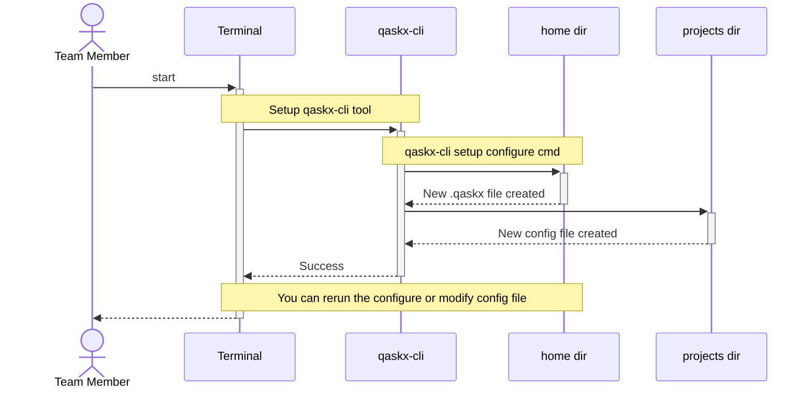

# Setup desktop (start)

This is the setup desktop tasks that is performed by 
the developers, though others that are updating code
including documentation can also perform the setup. 

This task is expected to be done only once for a desktop
environment, and the environment can be used for 
multiple projects and deliveries.

## Software installation

Please ensure the following tools or equivalents are
installed or you have access to servers with the
associated capabilities.

* A Git repository server - Github, Gitea
* Rights to create a Git repo and push content to the remote Git repo
* Git installed on local desktop
* Integrated development environment (IDE) software on local desktop - Visual Studio Code, IntelliJ
* Access to an OpenAPI editor - ApiCurio, Swagger UI
* Installed **qaskx-cli** tool on local desktop - download from *TBA* 
* Access to a Configuration Management Database (CMDB) - ServiceNow, Zenoss
* Access to an API registry portal - Apiman.io, Redocly

The server based software above could be executed as docker images
on your local desktop, but this would be only for
demonstration purposes.

Configuring and initialising the software above is left for you to follow
any existing standards you may have.  The qaskc-cli setup is below.

## Sequence diagram

The qaskx-cli has a setup command that creates the basic configuration
files that it uses.  If or when you need to change the defaults, you will
commonly make the changes permanent by changing the configuration files.

This includes items such as:

* Your details and your organisation
* Your git details
* Preferred programming language
* Template (remote) locations

You can read further information on each file in documents:

* [.qaskx](config/dotaskx.md)

Now have a look at the steps below to setup the files.

# End Status of flow

At the end of the above setup steps the desktop will have the base tools
that are mentioned in subsequent documents, and you will have
access to the server features.

The next step in the process is covered in [project_start](project_start.md)

# Reading Notes

The suggested tools are only that, suggestions.  You can substitute 
your own preferred tools as appropriate.  The concept is still valid
and your mileage may vary.

