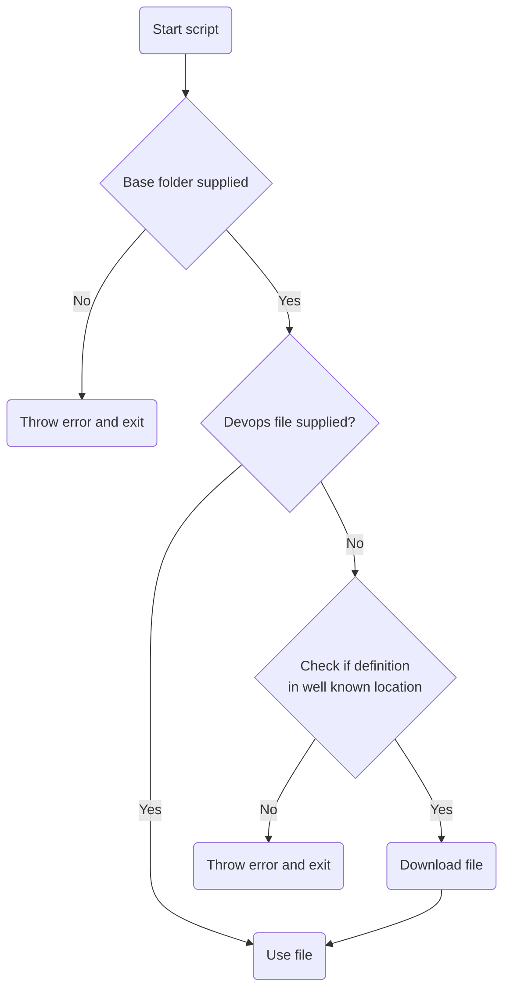

# Microservice example

# Update Powershell script

The Powershell script does the following:

```mermaid

graph TD

     A(Start script) --> B{Base folder supplied}
     B --> |No| C(Throw error and exit)
     B --> |Yes| D{Devops file supplied?} 
     D --> |No| E{Check if definition <br> in well known location}
     D --> |Yes| G(Use file)
     E --> |Yes| F(Download file) 
     E --> |No| I(Throw error and exit)
     F --> G

```

