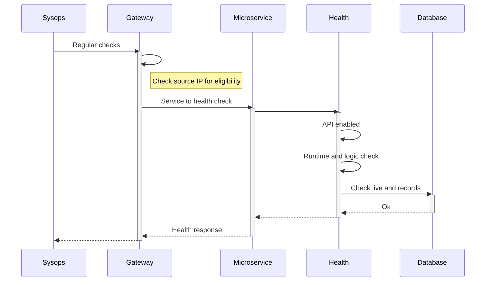
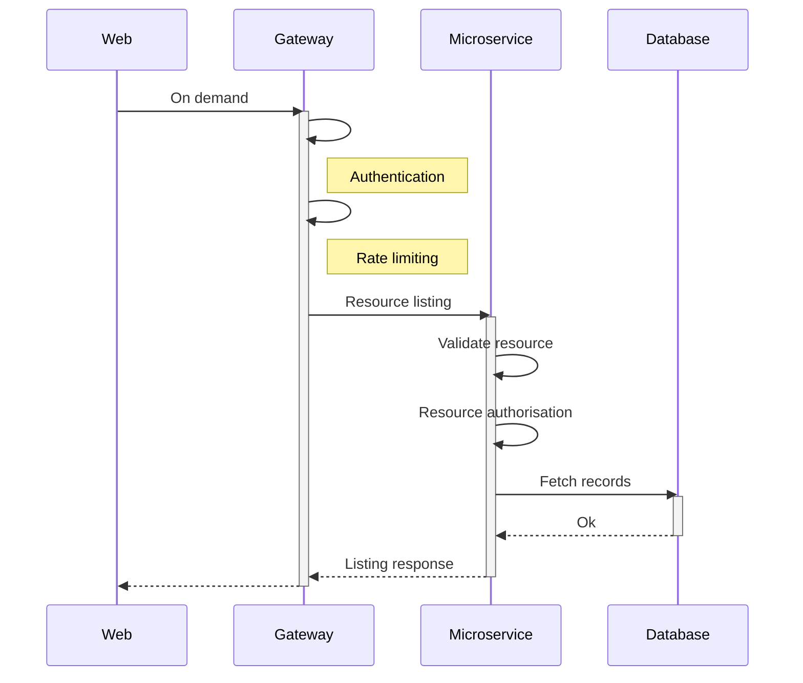

# Typical Microservice

## Service sequence diagrams

### Health check

The health sequence diagram for a typical microservice might be:

### Resource listing

The resource listing sequence diagram for a typical microservice might be:

